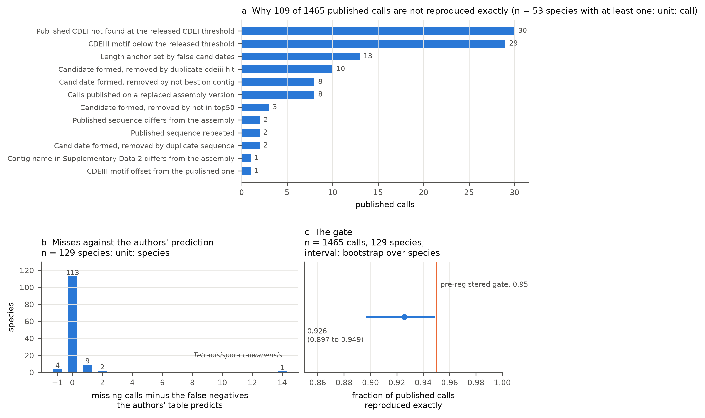
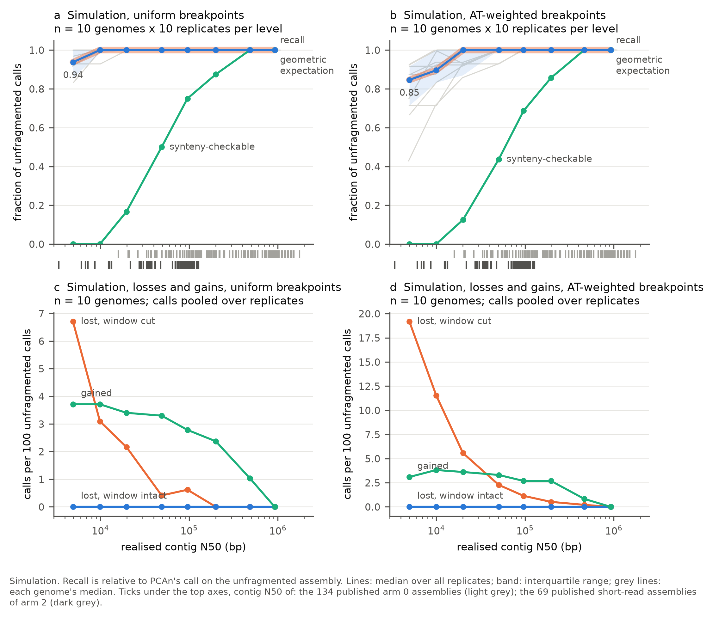
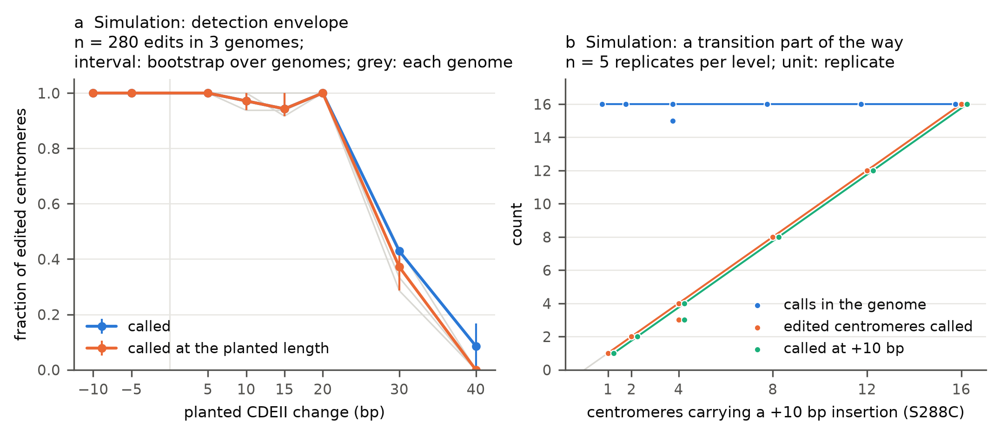
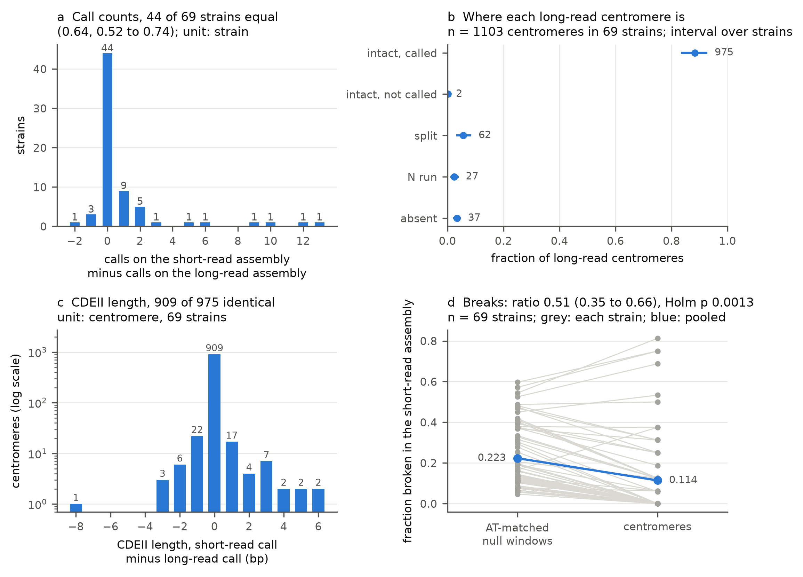
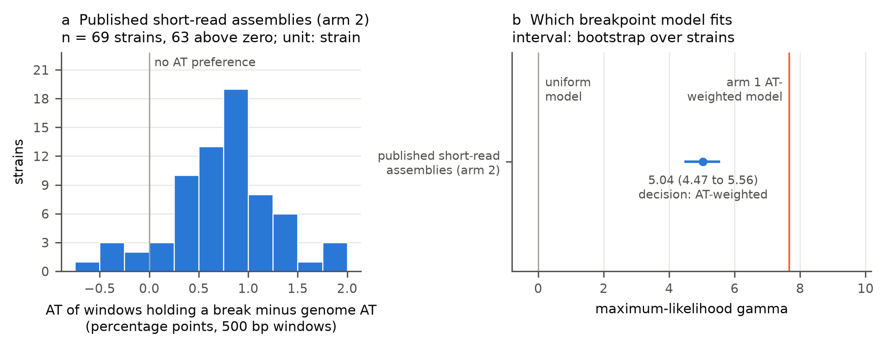

# PCAn loses point-centromere calls where assemblies break, and rarely otherwise

## Summary

This repository measures how the calls of PCAn v1.0 (Helsen et al. 2026), a
tool that predicts point centromeres in budding yeast genome assemblies,
depend on the assembly they are made from. Installed from its pinned commit
with MEME suite 4.11.2, PCAn reproduced 1,356 of 1,465 published calls exactly
across 129 Saccharomycetaceae species, a fraction of 0.926 (95 per cent
interval 0.897 to 0.949) that falls short of the 0.95 gate fixed in advance.
Each of the other 109 calls has a recorded cause, and for 113 species the
number of calls not recovered equals the number the authors' own table
predicts. PCAn called all 16 centromeres of the S288C reference, each with
SGD's boundary between CDEII and CDEIII, and five runs gave identical output.
In a simulation that cut ten chromosome-level assemblies into contigs (1,600
replicates holding 15,520 unfragmented calls), 518 calls were lost and every
one had a breakpoint inside its extraction window; none was lost with its
window intact, and all 391 calls gained were candidates that PCAn's
one-call-per-contig rule had suppressed before the cuts. At a contig N50 of 5
kb, mean recall relative to the unfragmented call was 0.93 with uniform
breakpoints and 0.79 when breakpoints favoured AT-rich sequence. Planted CDEII
changes of -10 to +20 bp were reported at the planted length in 207 of 210
edits; changes of +30 and +40 bp mostly fell outside PCAn's 30 bp length
anchor. In 69 *Saccharomyces cerevisiae* strains with a published short-read
and a long-read assembly, 975 of the 1,103 PCAn calls on the long-read
assemblies were intact and called in the short-read assembly: 603 of 608 in
homozygous strains and 372 of 495 in heterozygous ones. Two intact regions
went uncalled. Calls were broken at about half the rate of AT-matched null
windows (ratio 0.51, 0.35 to 0.66), and the breakpoints of the short-read
assemblies fell in AT-rich windows more often than uniform placement predicts
(maximum-likelihood gamma 5.0, 4.5 to 5.6). Arm 3, which assembles real reads
at known depths, was still running when this was written.

## Background

### Point centromeres

In budding yeasts of the Saccharomycetaceae, the centromere of each
chromosome is a short DNA sequence on which the kinetochore assembles. This is
a point centromere. It has three parts. CDEI is a short motif bound by the
protein Cbf1. CDEII is an AT-rich stretch wrapped around the centromeric
nucleosome, which carries the histone H3 variant Cse4; in the 16 centromeres
of the *S. cerevisiae* reference, SGD's CDEII features are 76 to 85 bp long
(`results/arm0/s288c_vs_sgd.tsv`). CDEIII is a motif of about 25 bp bound by
the CBF3 complex. PCAn's 1,519 calls on the arm 0 assemblies have a median
length of 118 bp from the start of CDEI to the end of CDEIII, and 98 per cent
of them lie between 65 and 201 bp (`results/arm0/reproduced_calls.tsv`). How
CDEII length changes across species is one of the traits the PCAn paper
follows.

### How PCAn finds one

PCAn (Helsen et al. 2026; software, Zenodo 10.5281/zenodo.17293587) scans an
assembly with FIMO for a CDEIII motif, takes a window upstream of every hit,
scans each window for a CDEI motif, and scores every pair of CDEI and CDEIII
hits from the two motif scores and the AT content of the CDEII between them.
It keeps the 50 best pairs and takes the median CDEII length of the top five
as an anchor. It then removes pairs whose CDEII length is more than 30 bp from
the anchor or whose CDEII AT content is 70 per cent or less, keeps one pair
per CDEIII hit, per sequence and per contig, and removes pairs that are
outliers in both length and AT content. What survives is the call set.
Motifs and thresholds are set per genus. Where the released code and the
paper's description differ, this repository follows the code, and the
differences are listed under Pipeline.

### What contig N50 says, and what it does not

Contig N50 is the length L such that contigs of length L or longer hold half
of the assembly. It measures contiguity and nothing else. An assembly can have
a high N50 and be wrong, because a misjoin makes a contig longer, or a low N50
and be accurate base for base. Two assemblies with the same N50 can have very
different length distributions, which is why every arm 1 replicate also
records L50 and the contig count. Here contig N50 is always computed after
splitting sequences at every run of N, so that published scaffolds, cut
replicates and new contig assemblies sit on one axis.

### What sequencing depth changes

A short-read assembler joins reads that overlap. At low depth some stretches
of the genome have no reads at all and the assembly breaks there. More depth
closes those gaps until repeats longer than the reads become the limit.
Illumina libraries tend to under-cover very AT-rich sequence, and CDEII is
among the most AT-rich sequence in a yeast genome, so a centromere is a
plausible place for a short-read assembly to break. Heterozygosity adds a
second effect: where the two copies of a region differ, a short-read
assembler may keep both as separate contigs.

### Why a missing call is ambiguous

When PCAn reports no centromere where one is expected, four things can be
true. The sequence may be absent from the assembly. It may be present but
split across two contigs. It may be present and whole, with PCAn's filters
removing it. Or the strain may carry a centromere that PCAn's motifs do not
match. Only the last says something about the genome. Arms 2 and 3 tell the
first three apart by finding the sequence on either side of each centromere in
the other assembly.

### Self-consistency is not accuracy

Arm 1 compares PCAn's calls on an altered assembly with its calls on the same
assembly unaltered, and arms 2 and 3 compare PCAn's calls on two assemblies of
one strain. Agreement in either case means PCAn's output is stable across the
change; it does not mean the calls are right. Arm 0 measures agreement with
the published table, which is agreement with the authors' output. The only
external truth in this repository is the S288C reference against SGD's
centromere annotation.

## Data

Every file except the arm 3 reads was downloaded on 2026-10-09 (UTC); the
reads of each arm 3 strain were streamed when that strain was processed
(`logs/arm3_strains.tsv`). Sizes, SHA-256 checksums, source checksums where
the source publishes one, and download times are in `logs/downloads.tsv`,
`logs/assemblies_arm0.tsv` and `logs/assemblies_arm2.tsv`.

### PCAn and the published calls

PCAn comes from github.com/JHelsen/point-centromere-detection at commit
a5fa46f0cb971e7d499fd52b38b0c29166b33ef8, the v1.0 release archived on Zenodo
(10.5281/zenodo.17293587). Its pipeline code is identical to the GitHub v1.0
tag and to the repository's head on the download date; only README files
differ. One patch is applied
(`patches/0001_arxiozyma_cdeiii_motif.patch`): the *Arxiozyma* entry of the
motif table names a CDEIII motif file, `CDEIII_Ktel_MEME.txt`, that is not in
the repository, so PCAn stopped with a FileNotFoundError on every
*Arxiozyma* assembly. The patch points the entry at
`CDEIII_Arxiozyma_MEME.txt`, which ships with PCAn and which the authors' own
per-species table names for all seven *Arxiozyma* species. Nothing else is
changed.

The published calls are Supplementary Data 2 of Helsen et al. 2026, with
Supplementary Data 4, 5 and 6 (centromere sequences of the *S. cerevisiae*
assemblies, the species and assemblies, and the sources of the
*S. cerevisiae* assemblies), taken from the publisher. Supplementary Data 2,
5 and 6 were also taken from the Figshare collection
(10.6084/m9.figshare.c.7630151; files 28225061 version 2, 28225067 version 3
and 28225076 version 1, each MD5-checked), and the two copies agree in every
cell (`results/arm0/source_concordance.tsv`).

### Arm 0: published assemblies

Supplementary Data 5 has 166 rows. Of these, 28 are out of scope: 20
Mucoromycota, 4 Saccharomycodaceae and 4 outgroups. Of the 138 Saccharomycetaceae species, 3
*Naumovozyma* species are excluded, because their calls came from an adapted
single-motif version of PCAn that the repository does not provide and PCAn
v1.0 has no *Naumovozyma* entry. Four species (three *Yueomyces* and
*Grigorovia jiainica*) were published without CDEI and are compared on their
CDEIII loci only, outside the reproduction fraction. *Arxiozyma slooffiae* has
no published calls and is run and reported. That leaves 130 species. NCBI had
suppressed the assembly listed for one of them, *Maudiozyma bulderi*
(GCA_933962305.1, now GCA_933962305.2); nothing was used in its place
(`results/arm0/excluded_assemblies.tsv`). The gate therefore covers 129
species and their 1,465 published calls. In all, 134 assemblies were
downloaded by exact accession and version, 0.51 GB compressed. One more,
GCA_003707555.1, the predecessor of the *Kluyveromyces aestuarii* assembly in
Supplementary Data 5, was run only to find the cause of a discrepancy
(`config/arm0_diagnostics.tsv`). Roles and reasons for all 166 rows are in
`config/species_arm0.tsv`.

The S288C reference is SGD release R64-5-1
(`S288C_reference_genome_R64-5-1_20240529.tgz`); its 16 chromosomes are
identical, base for base, to NCBI's GCA_000146045.2
(`results/arm0/s288c_sequence_check.tsv`).

### Arm 1: the assemblies that were altered (simulation)

Of the 33 chromosome-level or complete assemblies in the reproduction set, 26
have as many PCAn calls as nuclear chromosome sequences; the other 7 do not
and are ineligible (`results/arm1/eligibility.tsv`). The rule in
`config/arm1_design.md`, written before any replicate ran, took one per genus
by highest contig N50: ten genomes from *Ashbya*, *Eremothecium*,
*Huiozyma*, *Kazachstania*, *Kluyveromyces*, *Lachancea*, *Nakaseomyces*,
*Saccharomyces*, *Torulaspora* and *Zygosaccharomyces*, holding 6 to 16 calls
each and 97 in all (`results/arm1/genomes.tsv`). For the planted variants,
the same file's rule took S288C, the genome with the shortest median CDEII
(*Kazachstania africana*, 49 bp) and the one with the longest (*Eremothecium
gossypii*, 167 bp) (`results/arm1/variant_genomes.tsv`).

### Arm 2: published short-read and long-read assemblies of one strain

The long-read assemblies are the telomere-to-telomere panel of O'Donnell et
al. 2023 (ScRAP), taken from NCBI: 69 accessions, sequenced with Oxford
Nanopore and Illumina, 36 at contig and 33 at scaffold level, with contig N50
of 438 to 952 kb (median 910 kb; `results/arm2/assembly_stats.tsv`). The
short-read assemblies are those of
Peter et al. 2018, distributed as one archive by the 1002 Yeast Genomes
project (`1011Assemblies.tar.gz`, 3,999,623,201 bytes, MD5
10cd6ced9cd9a1064ee35583d644c458, matching the server's `md5.txt`). Their
contig N50 ranges from 3.4 to 128 kb (median 84 kb;
`results/arm2/short_read_assembly_stats.tsv`). Peter et al. built them with
ABySS from Illumina reads, as their Methods describe.

Strains were matched by identifier, never by name alone. ScRAP's
supplementary table gives each of its 142 strains a standardized name, and
for 69 of them that name is a strain code of Peter et al.'s Table S1; those 69
are the pairs. The other 73 were dropped because their standardized name is
not in Table S1 (`results/arm2/pair_candidates.tsv`). Of the 69 long-read
assemblies, 68 are haploid or collapsed assemblies and one is ScRAP's diploid
assembly of a heterozygous strain (`config/arm2_pairs.tsv`). Peter et al.'s
Table S1 lists 38 of the strains as homozygous and 31 as heterozygous.

### Arm 3: Illumina reads

The reads are the paired-end Illumina HiSeq 2000 runs of ENA study PRJEB13017,
the 1002 Yeast Genomes project. Each run was linked to its strain through the
reads-file name in Peter et al.'s Table S17, which matches the submitted file
names of the run in ENA. Of the 69 arm 2 strains, 33 qualify under the
registered rule (homozygous, euploid, a haploid or collapsed long-read
assembly, and a linked run); 36 do not: 28 are not homozygous, 5 are not
euploid, 2 are neither, and 1 has a diploid long-read assembly and is
heterozygous. The 33 runs, with base counts, read counts, file MD5s, the
linking evidence and the depth available (104x to 668x, median 301x), are in
`config/arm3_runs.tsv`.

## Pipeline

Bash runs every stage; Python is called from bash. Each stage skips work it
has already done and says so, measures itself through
`scripts/lib/measure.py` (elapsed time, peak resident memory, the data
directory's footprint, the drive's free space; `logs/resources.tsv`), and
refuses to start, with the shortfall, when its projected time or disk exceeds
the budget in `project.conf`. The results here came from WSL 2 on Windows,
with 16 threads and 5.8 GB of RAM visible to Linux, less than the 16 GB the
design assumed; SPAdes was capped at 4 GB accordingly.

`bash scripts/00_configure.sh --disk 35 --data-dir <path> --yes` writes
`project.conf`. The drive had 50.8 GB free, so the working budget was set to
35 GB, with the hard ceiling 10 per cent above it. The data directory sat on
the Linux filesystem: creating 500 small files took 6.05 s on the Windows drive
mounted in WSL and 0.02 s there.

`bash scripts/01_install.sh` builds two conda environments. PCAn's is built
from the exact pins of its `pcan_specs.yml` (Python 3.8.17, MEME suite
4.11.2, BLAST+ 2.16.0, Biopython 1.83, pandas 2.0.3), because a later FIMO
can compute p-values differently at a threshold boundary. The pins solve only
with flexible channel priority, which the script sets for that environment
alone. Everything else goes in a second environment (`logs/versions.tsv`).
Explicit lock files are in `env/`. `conda clean` then freed 0.80 GB
(`logs/conda_clean.tsv`). Measured: 622 s.

`bash scripts/02_fetch_tables.sh` fetches the supplementary tables, the
Figshare copies, the Figshare listing and the SGD release, records checksums,
and converts them to TSV. SGD's HTTPS host reset the connection repeatedly,
so the release comes from SGD's archive bucket on Amazon S3, by path.

`bash scripts/03_fetch_assemblies.sh --set arm0` checks each accession
version's status with NCBI before downloading it with the NCBI datasets
command-line tool; a replaced or suppressed version is listed and nothing is
substituted. Measured: 906 s for 134 assemblies.

`bash scripts/04_run_pcan.sh --assembly <fasta.gz> --genus <genus> --out <tsv>`
is the only place PCAn runs. PCAn asks four questions on standard input (the
genome path, the genus, the *Kazachstania* species, and whether to run the
BLAST synteny step); the wrapper answers them from its arguments and answers
no to BLAST, because synteny here is judged geometrically, as whether 10 kb
flanks survive on one contig. PCAn runs FIMO twice into the same output
directory, overwriting the first pass with the second; a pass-through FIMO
wrapper keeps both passes, gzip, with their command lines. The wrapper then
replays PCAn's candidate building and filters in PCAn's own environment
(`scripts/lib/pcan_trace.py`), so that pandas sorts tied scores exactly as
PCAn does, and records the filter that removed each candidate. The replay
reproduced PCAn's call table in every one of the 2,342 runs made for arms 0
to 2: 134 in arm 0, 2,070 in arm 1 and 138 in arm 2 (`logs/arm0_runs.tsv`,
`results/arm1/fragmentation_runs.tsv`, `results/arm1/variant_runs.tsv`,
`results/arm2/pcan_runs.tsv`).

Where the code differs from the paper's description, the code was followed:

- The window cut upstream of a CDEIII hit runs from 249 bp before the hit's
  start to its end: 275 bp on the forward strand and 276 bp on the reverse,
  where the paper describes 250 bp.
- CDEIII thresholds are 1e-5 to 1e-7 for the species analysed here; the paper
  gives a range of 1e-3 to 1e-7. CDEI thresholds are 1e-2, except 1e-3 for
  *Arxiozyma*, *Kluyveromyces* and *Zygosaccharomyces*.
- Candidates are deduplicated by CDEIII hit, by sequence and by contig, so a
  contig carries at most one call.
- Candidates with a combined score of zero or less are removed.
- The CDEII AT percentage is computed over a stretch shifted one base towards
  CDEIII and divided by its length plus one.
- The *Arxiozyma* motif file named in the code is missing (see Data).
- The *Yueomyces* entry uses the *Saccharomyces* CDEIII motif. A *Yueomyces*
  CDEIII motif file ships with PCAn, and the authors' per-species table names
  it, but no entry uses it. The protocol registered for arm 0 runs every
  species with the code's own entry, so the *Yueomyces* species were run with
  the *Saccharomyces* motif, and a diagnostic compares the two (Results).

`python scripts/05_reproduce.py --jobs 8` runs arm 0 and compares every
published call with the reproduction by the protocol committed before any run
(`config/arm0_reproduction.md`). Supplementary Data 2 gives sequences but no
coordinates, so each published call is placed by searching for its sequence
on its contig, on both strands; a sequence found zero or several times is
reported as unlocated, never forced. Every call that is not exact gets a cause
from the filter trace. Measured: 948 s with 8 parallel PCAn runs; one PCAn run
took a median of 21.9 s (10.2 to 389.6 s; `logs/arm0_runs.tsv`).

`python scripts/06_fragment.py --jobs 8` cuts each arm 1 genome at a Poisson
rate found by bisection to reach a target contig N50 of 1,000, 500, 200, 100,
50, 20, 10 or 5 kb, under two models: uniform, and AT-weighted, where the
probability of a cut in a 500 bp window is proportional to exp(gamma (a -
a_genome)), with a the window's AT fraction and gamma = ln(10) / 0.30, a
tenfold rise per 30 percentage points of AT. Ten seeded replicates per genome,
model and level; clean cuts, no sequence removed. Each replicate's FASTA is
deleted after PCAn has run, since its seed regenerates it. Measured: 4,520 s
for 1,900 replicates (1,600 for the two models and 300 for the gamma
sensitivity analysis) with 8 parallel runs, in two runs, because the first
was stopped on request after 358 replicates and the second skipped them. No
replicate had to be cut to fit the 24 hour budget (`results/arm1/cuts.tsv`).
Of the replicates, 140 needed no cut, because the assembly was already at or
below the target, and were scored without a PCAn run.

`python scripts/07_plant_variants.py --jobs 8` edits CDEII the way the paper's
microhomology examples suggest: an insertion duplicates an adjacent stretch of
CDEII in tandem, and a deletion removes a stretch from inside it, never
touching CDEI or CDEIII. Random insertions would shift AT content in a way
real variants do not, and PCAn scores AT content. Single edits of -10, -5, +5,
+10, +15, +20, +30 and +40 bp at every centromere of the three genomes (280
runs), and, in S288C, +10 bp at 1, 2, 4, 8, 12 and all 16 centromeres, five
seeded replicates per level (30 runs). Measured: 840 s.

`python scripts/08_score_perturbations.py` scores every unfragmented call in
every replicate as retained exactly, retained with other boundaries, lost with
a cut in its window, or lost with the window intact, and gives the filter
responsible for the last. Measured: 45 s.

`python scripts/09_build_pairs.py` builds the arm 2 pairs and the arm 3 runs
from the ScRAP and Peter et al. tables, the Peter et al. archive and ENA's run
report for PRJEB13017, with every exclusion and its reason. Measured: 5,043 s,
nearly all of it the 4.0 GB archive.

`bash scripts/03_fetch_assemblies.sh --set arm2` fetches the 69 long-read
assemblies (622 s). `python scripts/10_compare_pairs.py --arm 2 --jobs 4` then
runs PCAn on both assemblies of every strain and compares them by the method
registered in `config/analysis_plan.md` before any arm 2 data were examined
(commit cbf81a5, 2026-10-09 04:41 UTC). The 2 kb flanks on either side of each
long-read call are aligned to the short-read assembly with minimap2
(`-x asm10`); a flank is placed only if exactly one primary alignment has
identity of at least 0.95, covers at least 90 per cent of the flank and has
mapping quality of at least 20. Nothing is forced. Each call gets one of five
statuses: intact and called, intact but not called, split, containing an N
run, or absent. Twenty null windows per call, matched on length and on AT
content within 2.5 percentage points, go through exactly the same steps,
because a null that skipped the liftover would measure the liftover. Measured:
1,982 s with 4 parallel jobs, peak 1,840 MB. That first run stopped in its
final aggregation: pandas had read the null windows' kind, the word "null",
as a missing value, and the line summarising C5 failed. Both were fixed
before any confirmatory result was written; the aggregation alone takes
about 160 s (`logs/resources.tsv`).

`bash scripts/11_assemble_reads.sh` processes the 33 arm 3 strains one at a
time in the registered order. Each read file is downloaded from ENA,
resuming any transfer that breaks, checked against ENA's MD5, and fanned out
in one pass through named pipes to seqtk, which draws every depth and seed;
then it is deleted. The registered design streamed the reads instead, but on
this link the first strain's streams broke repeatedly, once with a TLS
record that failed its integrity check, and a broken stream must start again
from its first byte; the change and its date are at the end of
`config/analysis_plan.md`. While one strain assembles, the next strain's
reads download, because the link and the processors would otherwise sit idle
in turn; assemblies never overlap. Reads and working directories are deleted
when a strain is done, or by the cleanup trap if it is interrupted. SPAdes
runs under the 4 GB cap from `project.conf`, which limits its address space
rather than its resident memory. On 16 threads it ran out of address space
at 40x and above for the first three strains while holding about 1.5 GB;
from the fourth strain on it runs on one thread per GB of the cap, 4 here,
which on BAM's 40x reads gave contigs identical to a 16-thread run without a
cap. The failed runs of the first three strains stay failed, as registered.
`python scripts/10_compare_pairs.py --arm 3` then compares every assembly
with the strain's long-read assembly by the arm 2 method.

`python scripts/12_analyse.py` writes the reporting summary, with Holm's
correction across the fourteen registered tests, and decides for every
sensitivity analysis whether it changes a conclusion by the rule set before
any sensitivity result was read. `python scripts/13_figures.py` draws the
figures.

Changes made after the analysis plan was registered are recorded, dated, at
the end of `config/analysis_plan.md`: the overlap of download and assembly in
arm 3, the download of reads to a file in place of a stream, two exploratory
additions to arm 2, and two points of implementation that change no arm 2
result.

## Results

### Question 1, arm 0: does this installation reproduce the published calls?

**PCAn v1.0 reproduced 1,356 of 1,465 published calls exactly (0.926, 0.897 to
0.949, bootstrap over 129 species), below the 0.95 gate, and every one of the
109 others has a recorded cause.**



Of the 109 calls that were not exact, 72 were not recovered at all, 24 were
recovered with a different CDEII length and 13 could not be placed on the
assembly (`results/arm0/per_centromere.tsv`). The causes, from the filter
trace (`results/arm0/non_exact_cause_counts.tsv`): the published CDEI was not
found at the released CDEI threshold for 30 calls, and the CDEIII motif
scored below the released threshold for 29. False candidates set the length
anchor for 13, all in *Tetrapisispora taiwanensis*. A named filter removed a
candidate that had formed for 23: the duplicate CDEIII hit filter (10), the
one-call-per-contig rule (8), the top 50 cut (3) and the duplicate sequence
filter (2). Eight calls were published on a replaced assembly version. Five
come from the table itself: a published sequence that differs from the
assembly (2), one that occurs in it twice (2), and one on a contig whose
name differs (1). In the remaining call, PCAn placed the CDEIII motif at an
offset from the published one.

The authors anticipated most of this. PCAn ships `ExpectedFalsePosFalseNegs.txt`,
which gives for each species the number of published calls v1.0 is expected
to miss and the number of extra calls it is expected to make. For 113 of the
129 species the number of calls this installation did not recover equals the
authors' number, and for 106 the extra calls do too
(`results/arm0/authors_expected_vs_observed.tsv`). Software version was
checked first. The pinned commit's pipeline code is unchanged in later
versions, and rescoring every candidate with the AT formula behind the
published CDEII column leaves 934 published calls standing against 1,356
with v1.0's own formula (`results/arm0/diagnostic_at_formula.tsv`). Input
differences came second: on the replaced version of the *K. aestuarii*
assembly, all 8 of its published calls are reproduced exactly
(`results/arm0/diagnostic_replaced_versions.tsv`). The decision to continue
with arms 1 to 3, with its reasons, is in `config/arm0_gate_decision.md`; the
protocol allowed it once the cause had been found and reported.

Every published call was reproduced exactly in 76 of the 129 species (0.589,
Wilson interval 0.503 to 0.670; `results/arm0/gate.tsv`). PCAn made 105 calls
in the reproduction set that overlap no published call
(`results/arm0/species_counts.tsv`; every extra call is listed in
`results/arm0/extra_calls.tsv`). For the four CDEIII-only species, 8 of 55
published CDEIII loci carry a PCAn call with the same CDEIII
(`results/arm0/species_counts.tsv`). Three of the four are *Yueomyces*,
which PCAn's entry searches with the *Saccharomyces* CDEIII motif. Run as
PCAn's first pass runs it, FIMO hits 16 of their 40 published CDEIII loci with
that motif and 38 with the *Yueomyces* motif that the authors' table names
and PCAn ships without using (`results/arm0/diagnostic_cdeiii_motif.tsv`).
The published *Yueomyces* loci came from the motif PCAn's entry does not
use. For *G. jiainica* neither the entry's threshold nor the table's finds
most of its 15 published loci (4 and 1).

On S288C, PCAn called all 16 SGD centromeres and nothing else. Each call
covers SGD's centromere feature to within 1 bp at either end, and the boundary
between CDEII and CDEIII matches SGD's in all 16. PCAn's CDEII is 2 bp longer
than SGD's in every case; SGD's CDEI features are 10 bp long and PCAn's CDEI
motif is 8 bp (`results/arm0/s288c_vs_sgd.tsv`).

FIMO never reached its cap of 100,000 stored matches: the largest first pass
held 2,927 hits (`results/arm0/fimo_cap.tsv`), so no call depends on genome
size through that cap.

### Question 2, arm 1a (simulation): what survives fragmentation?

**In the simulation, every lost call had a breakpoint inside its extraction
window, and mean recall at a contig N50 of 5 kb was 0.93 with uniform
breakpoints and 0.79 with AT-weighted ones.**



Recall here is relative to the unfragmented call; it is self-consistency, not
accuracy. Across 1,600 replicates, 15,520 unfragmented calls were scored:
15,002 retained, 518 lost, every lost call with a cut in its window, and none
lost with the window intact (`results/arm1/fragmentation_replicates.tsv`,
`results/arm1/pipeline_losses_by_filter.tsv`). The geometric rule predicted
520 losses. Two of those calls survived: one on a fragment of 170 bp, and one
recovered with a different CDEI that shortened its CDEII from 49 to 23 bp
(`results/arm1/fragmentation_calls.tsv`). Mean recall over genomes, with
bootstrap intervals over the ten genomes (`results/arm1/recall_pooled.tsv`;
the figure shows the median over replicates instead, which is higher at 5 kb
because a few genomes lose many calls):

| Target contig N50 | Uniform | AT-weighted |
| --- | --- | --- |
| 50 kb | 0.996 (0.992 to 0.999) | 0.973 (0.952 to 0.989) |
| 20 kb | 0.979 (0.972 to 0.985) | 0.938 (0.910 to 0.963) |
| 10 kb | 0.967 (0.952 to 0.980) | 0.865 (0.797 to 0.924) |
| 5 kb | 0.926 (0.901 to 0.946) | 0.786 (0.696 to 0.861) |

At 200 kb and above, recall is 0.994 or more under both models. The
AT-weighted model costs more calls because CDEII is AT-rich, which puts cuts
where calls are. The calls gained, 391 in all, are a pipeline effect of
another kind: each was a candidate that PCAn's one-call-per-contig rule had
removed from the unfragmented assembly, which became the best candidate on a
contig of its own once the cuts separated it from the unfragmented call
(`results/arm1/gained_calls_by_origin.tsv`). A call that survives may still
lose the evidence used to confirm it: the median fraction of calls whose
contig extends 10 kb beyond both ends was 0.50 (uniform) and 0.44
(AT-weighted) at 50 kb, and zero at 10 kb and below. The published arm 0
assemblies have contig N50 of 16 kb to 1.75 Mb (median 220 kb;
`results/arm0/assembly_stats.tsv`), and the arm 2 short-read assemblies 3.4 to
128 kb; both sets are marked under the top panels.

### Question 3, arm 1b (simulation): planted CDEII variants

**In the simulation, PCAn reported planted CDEII changes of -10 to +20 bp at
the planted length in 207 of 210 edits, and did not recover most changes of
+30 bp or more, which fall outside its 30 bp length anchor.**



For each size, 35 centromeres were edited one at a time across the three
genomes (`results/arm1/detection_envelope.tsv`). At -10, -5, +5 and +20 bp
all 35 were called at the planted length; at +10 bp, 34; at +15 bp, 33. The
three misses were removed by the filter for outliers in both length and AT
content (`results/arm1/planted_single.tsv`). At +30 bp, 15 edited centromeres
were still called and 13 at the planted length; at +40 bp, 3 were called and
none at the planted length. The 52 edits not recovered at those two sizes were
all removed because their CDEII length fell more than 30 bp from the anchor;
the 5 called at another length took a different CDEI. The interval for these
fractions comes from three genomes and is rough.

The progressive design asks whether PCAn can count a genome part of the way
through a transition. With +10 bp edits at 1, 2, 4, 8, 12 or 16 of S288C's
centromeres, PCAn called a median of 16 centromeres at every level, and every
edited centromere at the planted length in 29 of 30 replicates; in one
replicate at 4 edits it called 3 of them and 15 in all. Unedited centromeres
were unchanged in every replicate (`results/arm1/planted_progressive.tsv`).
For a change of 10 bp, the median anchor does not stop PCAn from counting a
mixed genome.

### Question 4, arm 2: do calls on a published short-read and long-read assembly of one strain agree?

**In 69 strains, 975 of 1,103 calls on the long-read assembly were intact and
called in the published short-read assembly; 126 were broken there and 2 were
intact but not called.**



These are the confirmatory outcomes registered in `config/analysis_plan.md`
(`results/arm2/confirmatory.tsv`). PCAn made 15 to 17 calls on each long-read
assembly (16 in 66 strains).

C1. The two assemblies gave the same call count in 44 of 69 strains (0.638,
Wilson interval 0.520 to 0.741). Where they differed, the short-read assembly
usually had more calls, by up to 13.

C2. Of 1,103 calls on the long-read assemblies, all liftable, 975 were intact
and called in the short-read assembly (0.884, bootstrap interval over strains
0.834 to 0.928), 2 intact but not called (0.002), 62 split (0.056), 27 in an N
run (0.024) and 37 absent (0.034). Both calls that were intact but not called
were removed by the one-call-per-contig rule: in each case the short-read
contig joins the region with another call that lies on a different contig of
the long-read assembly, and PCAn kept the other one
(`results/arm2/centromere_status.tsv`; the filter, from the trace, in
`results/arm2/exploratory_centromere_flanks.tsv`).

C3. Among the 975 intact calls, 909 had the same CDEII length in both
assemblies (0.932, 0.904 to 0.956). The other 66 differed by -8 to +6 bp; 62
of them are in heterozygous strains.

C4. Calls were broken in the short-read assembly at about half the rate of
AT-matched null windows: 126 of 1,103 calls against 4,926 of 22,060 windows,
a break-rate ratio of 0.51 (0.35 to 0.66) and a difference of -0.109 (-0.135
to -0.081). The stratified permutation test gave p = 0.0001 before
correction, the smallest value 10,000 permutations allow; after Holm's
correction it is 0.0013 (`results/reporting_summary.md`). Short-read
assemblies of these strains do not break at centromeres more often than in
other sequence of the same AT content; they break there less often.

Zygosity divides the strains sharply. This comparison is exploratory, though
excluding heterozygous strains is a registered sensitivity analysis. In the 38
homozygous strains, 603 of 608 calls were intact and called, 3 were split,
CDEII lengths agreed for 599 of 603, and call counts agreed in 33 strains. In
the 31 heterozygous strains, 372 of 495 were intact and called, CDEII lengths
agreed for 310 of 372, call counts agreed in 11, and 195 of the 566
short-read calls had no long-read counterpart, against 6 of 609 in
homozygous strains (`results/arm2/call_counts.tsv`,
`results/arm2/short_calls_without_long_counterpart.tsv`,
`figures/supplementary/figS2_zygosity.png`). The heterozygous short-read
assemblies are also longer and more fragmented: median total length 14.2 Mb
against 12.0 Mb, and median contig N50 34 kb against 99 kb
(`results/arm2/short_read_assembly_stats.tsv`).

Part of the "broken" count in heterozygous strains is not a break. Aligning
the flanks again and counting every full-length match, secondary ones
included, shows that for 46 of the 123 broken calls in heterozygous strains a
flank matches two or more places in the short-read assembly, as when both
haplotypes are kept as separate contigs; the registered rule leaves such a
flank unplaced, so the call counts as split or absent. For 34 a flank matches
nowhere, 27 have an N run between placed flanks, and 16 have both flanks
placed but too far apart, on different contigs or in opposite orientations.
The 3 broken calls in homozygous strains all have a flank that matches
nowhere. In heterozygous strains the doubly matched flank strikes calls and
null windows at a similar rate, 46 of 495 calls and 980 of 9,900 windows, so
it inflates both sides of C4 alike
(`results/arm2/exploratory_flank_summary.tsv`, exploratory). Supplementary
Data 4 of the PCAn paper lists two different centromere sequences for 14 of
the broken calls and 3 of the 66 calls with a different CDEII length, so
those may be allelic rather than errors of either assembly
(`results/arm2/centromere_status.tsv`, column `possibly_allelic`).

A call that survives may lose its synteny evidence: for 819 of the 975 intact
calls (0.84) the short-read contig extends 10 kb beyond both ends of the call,
529 of 603 in homozygous strains and 290 of 372 in heterozygous ones
(`results/arm2/exploratory_centromere_flanks.tsv`, exploratory).

### Question 5, arm 3: at what depth do calls and CDEII lengths settle?

Arm 3 was running when this was written; its results will be added when the
48 hour budget has been used.

### Across arms: which breakpoint model the real breaks resemble

**The breakpoints of the published short-read assemblies fall in AT-rich
windows more often than uniform placement predicts, with a maximum-likelihood
gamma of 5.0 (4.5 to 5.6), below the 7.7 of arm 1's AT-weighted model.**



Outcome C5 locates every short-read contig end on the long-read assembly
(36,791 ends in 69 strains; 2,414 more could not be located;
`results/arm2/breakpoint_summary.tsv`) and fits the gamma of arm 1's model to
the 500 bp windows that hold them. The log-likelihood is higher at arm 1's
gamma than at zero and the bootstrap interval of the fitted gamma excludes
zero, so by the registered rule the breaks resemble the AT-weighted model
(`results/arm2/confirmatory.tsv`). In 63 of 69 strains the windows holding a
break are richer in AT than the genome as a whole. The fitted gamma is lower
than the one arm 1 assumed: in these assemblies AT content raises the chance
of a break about 4.5-fold per 30 percentage points, where arm 1 assumed
tenfold. The closest arm 1 model is the sensitivity run at gamma = ln(5) /
0.30, about 5.4, under which mean recall in the simulation was 0.930 at a
contig N50 of 10 kb and 0.960 at 20 kb
(`results/sensitivity/arm1_at_weight_gamma.tsv`).

### A note for users of PCAn

The rule that keeps one call per contig is behind every call gained in the
simulation and both intact regions left uncalled in arm 2. On a fragmented
assembly it lets a second-best candidate through on a contig of its own; on a
contig that joins two centromeric regions it keeps one and drops the other. A
call on a short contig, or a contig that carries a second strong candidate,
deserves a second look. For *Yueomyces*, the CDEIII motif file that ships
with PCAn but is missing from its motif table is the one that finds the
published loci.

## Controls and sensitivity

Positive controls. S288C against SGD: 16 of 16 called, as described above.
The planted variants of arm 1b, where the right answer for every edit is
known in advance: PCAn's response is reported above. The liftover compared
each long-read assembly with itself:
all 1,103 calls came out intact and called (`results/arm2/liftover_control.tsv`).

Negative controls. Five PCAn runs on S288C gave byte-identical call tables,
FIMO passes and candidate tables, 4.7 to 5.8 s each
(`results/arm0/determinism.tsv`). The AT-matched null windows are the
comparison for C4.

Technical replicates. The ten fragmentation replicates per genome, model and
level give the interquartile ranges in Figure 2; the per-genome curves are in
`figures/supplementary/figS1_fragmentation_per_genome.png`.

Every threshold the design calls arbitrary was re-run at alternative values
(`results/sensitivity/summary.tsv`). For each alternative, a registered test
counts as changed if its Holm-adjusted significance at 0.05 or the direction
of its effect changes, and an estimate counts as changed if it falls outside
the primary 95 per cent interval; the rule was written before any sensitivity
result was read.

- No alternative changes the confirmatory test of C4. Its ratio stays below
  1 and significant with flanks of 1 or 5 kb (0.66, 0.71), AT bins of 2.5 or
  10 points (0.50, 0.57), placement identity of 0.90 or 0.99 (0.52, 0.65), and
  with heterozygous strains excluded (0.04).
- Estimates without a test move under some alternatives. Flanks of 5 kb lower
  the fraction intact and called to 0.793, because a longer flank is more
  likely to cross a break; identity of 0.99 raises the split fraction from
  0.056 to 0.102; flanks of 1 kb shrink the C4 difference to -0.060.
  Excluding heterozygous strains raises C1 to 0.868, C2 to 0.992 and C3 to
  0.993, each outside the primary interval
  (`results/sensitivity/arm2_variants.tsv`).
- In arm 1, AT weighting of ln(5) / 0.30 and ln(20) / 0.30 moves mean recall
  outside the primary interval at 10 kb and at 20 kb respectively
  (`results/sensitivity/arm1_at_weight_gamma.tsv`). In one replicate at the
  steeper weighting (*Ashbya aceri*, 10 kb), the length anchor removed two
  calls whose windows were intact: the only losses of that kind in 1,900
  replicates.
- The arm 0 gate decision is the same at 0.99 and different at 0.90, where
  0.926 would pass (`results/sensitivity/arm0_gate_threshold.tsv`).

## Repository structure

```text
pcan_assembly_dependence/
  config/      what was fixed in advance, and dated records of later decisions
    analysis_plan.md       arms 2 and 3, registered (commits cbf81a5, a005d21, dd4693d)
    arm0_reproduction.md   how arm 0 is judged, committed before any run
    arm0_gate_decision.md  the record of continuing past the arm 0 gate
    arm0_diagnostics.tsv   assemblies run only to explain a discrepancy
    arm1_design.md         genome choice, levels, models, seeds
    species_arm0.tsv       every Supplementary Data 5 row, its role and reason
    arm2_pairs.tsv         the 69 strain pairs and the evidence for each
    arm3_runs.tsv          the 69 strains, the 33 eligible runs, and why the rest are not
    project.conf.example   the format of the machine-specific project.conf
  env/         explicit conda lock files, scrubbed of local paths
  scripts/     00 to 13, one per stage, and lib/ with the shared code
  tests/       known-answer tests, run by bash run_all.sh --test
  patches/     the one change PCAn needs to run Arxiozyma, with the reason
  results/     tables, sensitivity analyses, reporting summary (see results/README.md)
  figures/     main figures, with supplementary figures in figures/supplementary/
  data/        assemblies, reads in transit, environments and the PCAn checkout; not tracked, see data/README.md
  logs/        time, memory and disk per stage and per arm 3 strain; downloads; versions
  run_all.sh   the orchestrator
  LICENSE
  README.md
```

## Usage

The data directory peaked at 8.97 GB before arm 3 (`logs/resources.tsv`):
3.3 GB of conda environments, the 4.0 GB Peter et al. archive kept once with
its checksum, 0.78 GB of NCBI assemblies, and the rest PCAn outputs. Arm 3
adds, at any time, the downloaded read files of one strain (3 to 7 GB) and
the subsamples and assembler working directories of another; its per-strain
peaks are logged in `logs/arm3_strains.tsv`. Commands, in order, with the
times measured here:

```bash
bash scripts/00_configure.sh --disk 35 --yes        # writes project.conf; add --data-dir to move data/
bash scripts/01_install.sh                          # 622 s, 3.3 GB after conda clean
bash run_all.sh --test                              # 64 known-answer tests, 17 s
bash scripts/02_fetch_tables.sh                     # under a minute
bash scripts/03_fetch_assemblies.sh --set arm0      # 906 s, 0.51 GB
python scripts/05_reproduce.py --jobs 8             # 948 s
python scripts/06_fragment.py --jobs 8              # 4,520 s for 1,900 replicates, in two runs
python scripts/07_plant_variants.py --jobs 8        # 840 s for 310 runs
python scripts/08_score_perturbations.py            # 45 s
python scripts/09_build_pairs.py                    # 5,043 s, mostly the 4.0 GB archive
bash scripts/03_fetch_assemblies.sh --set arm2      # 622 s, 0.27 GB
python scripts/10_compare_pairs.py --arm 2 --jobs 4 # 1,982 s
bash scripts/11_assemble_reads.sh                   # up to the 48 h budget
python scripts/10_compare_pairs.py --arm 3 --jobs 4
python scripts/12_analyse.py
python scripts/13_figures.py
```

The Python stages run in the tools environment (`conda activate
<data>/env/tools`); `bash run_all.sh` does the activation and runs everything
above in order, and `bash run_all.sh --arm 0` or `--from compare` runs part of
it. Serial runs are the default (`--jobs 1`) so that timings stay comparable
between machines; memory is not the reason, since no PCAn run here peaked
above 108 MB (`logs/arm0_runs.tsv`, `results/arm2/pcan_runs.tsv`).

## Limitations

Arm 1 is a simulation. Its breaks are clean cuts placed by a model, where real
assemblies break at repeats, collapse duplicated sequence and carry
misjoins, and its edits follow one mutational mechanism, tandem duplication
or deletion of adjacent CDEII sequence.

Self-consistency is not accuracy. Arm 1 measures agreement with PCAn's own
call on the unaltered assembly, and arms 2 and 3 agreement between two
assemblies of one strain. Only a minority of the species have experimentally
validated centromeres; the S288C comparison is the only external truth here.

Arms 2 and 3 cover one species, *S. cerevisiae*, so they say nothing directly
about other genera, and PCAn's motifs and thresholds are clade-specific, so a
result in one clade does not transfer to another. The arm 2 short-read
assemblies all come from one study and one assembler, ABySS, and the
long-read assemblies from one panel. Arm 3 uses two assemblers and as many
strains as its time budget allowed.

The flank method cannot tell a doubly matched flank from a missing one under
the registered rule; the exploratory flank check shows how often that matters
in heterozygous strains. Supplementary Data 4 identifies chromosomes for only
part of the calls, so most broken calls in heterozygous strains carry no
allelic flag either way.

One FIMO version, 4.11.2, was used. The arm 0 reproduction is agreement with
the published table, which by its authors' account holds calls that PCAn
v1.0 does not make. This repository describes how PCAn behaves on the
assemblies analysed here and makes no claim about the biological conclusions
of the paper.

## Data availability

Everything in `results/`, `figures/` and `logs/` is regenerated by the
scripts from public sources: PCAn at commit a5fa46f (Zenodo
10.5281/zenodo.17293587), the supplementary data of Helsen et al. 2026
(Figshare 10.6084/m9.figshare.c.7630151 and the publisher), NCBI assemblies
by accession and version (`logs/assemblies_arm0.tsv`,
`logs/assemblies_arm2.tsv`), the Peter et al. 2018 assembly archive from the
1002 Yeast Genomes project, the SGD S288C release R64-5-1, and reads from
ENA study PRJEB13017 (`config/arm3_runs.tsv`). No assembly or read file is
redistributed. Tables in `results/arm0/` and `results/arm1/` include the
sequences of individual calls and edits, which come from NCBI assemblies.
Every results table is described column by column in `results/README.md`.

## Citation

The analysed tool and its data:

- Helsen J, Ramachandran K, Sherlock G, Dey G. Progressive coevolution of the
  yeast centromere and kinetochore. Nature 651, 1012-1019 (2026).
  doi:10.1038/s41586-025-09779-1
- PCAn v1.0, Zenodo. doi:10.5281/zenodo.17293587 (all versions:
  doi:10.5281/zenodo.17293586)
- Supplementary data of Helsen et al. 2026, Figshare.
  doi:10.6084/m9.figshare.c.7630151

Tools:

- Grant CE, Bailey TL, Noble WS. FIMO: scanning for occurrences of a given
  motif. Bioinformatics 27, 1017-1018 (2011). doi:10.1093/bioinformatics/btr064
- Bailey TL, Johnson J, Grant CE, Noble WS. The MEME Suite. Nucleic Acids
  Research 43, W39-W49 (2015). doi:10.1093/nar/gkv416
- Li H. Minimap2: pairwise alignment for nucleotide sequences.
  Bioinformatics 34, 3094-3100 (2018). doi:10.1093/bioinformatics/bty191
- Camacho C et al. BLAST+: architecture and applications. BMC Bioinformatics
  10, 421 (2009). doi:10.1186/1471-2105-10-421
- Shen W, Le S, Li Y, Hu F. SeqKit: a cross-platform and ultrafast toolkit for
  FASTA/Q file manipulation. PLoS ONE 11, e0163962 (2016).
  doi:10.1371/journal.pone.0163962; Shen W, Sipos B, Zhao L. SeqKit2.
  iMeta 3, e191 (2024). doi:10.1002/imt2.191
- seqtk 1.5, github.com/lh3/seqtk (no paper)
- Chen S, Zhou Y, Chen Y, Gu J. fastp: an ultra-fast all-in-one FASTQ
  preprocessor. Bioinformatics 34, i884-i890 (2018).
  doi:10.1093/bioinformatics/bty560
- Bankevich A et al. SPAdes: a new genome assembly algorithm and its
  applications to single-cell sequencing. Journal of Computational Biology
  19, 455-477 (2012). doi:10.1089/cmb.2012.0021; Prjibelski A et al. Using
  SPAdes de novo assembler. Current Protocols in Bioinformatics 70, e102
  (2020). doi:10.1002/cpbi.102
- Li D, Liu C-M, Luo R, Sadakane K, Lam T-W. MEGAHIT: an ultra-fast
  single-node solution for large and complex metagenomics assembly via
  succinct de Bruijn graph. Bioinformatics 31, 1674-1676 (2015).
  doi:10.1093/bioinformatics/btv033
- O'Leary NA et al. Exploring and retrieving sequence and metadata for
  species across the tree of life with NCBI Datasets. Scientific Data 11,
  732 (2024). doi:10.1038/s41597-024-03571-y
- Cock PJA et al. Biopython. Bioinformatics 25, 1422-1423 (2009).
  doi:10.1093/bioinformatics/btp163
- McKinney W. Data structures for statistical computing in Python.
  Proceedings of the 9th Python in Science Conference, 56-61 (2010).
  doi:10.25080/Majora-92bf1922-00a
- Harris CR et al. Array programming with NumPy. Nature 585, 357-362 (2020).
  doi:10.1038/s41586-020-2649-2
- Virtanen P et al. SciPy 1.0. Nature Methods 17, 261-272 (2020).
  doi:10.1038/s41592-019-0686-2
- Hunter JD. Matplotlib: a 2D graphics environment. Computing in Science and
  Engineering 9, 90-95 (2007). doi:10.1109/MCSE.2007.55
- Grüning B et al. Bioconda. Nature Methods 15, 475-476 (2018).
  doi:10.1038/s41592-018-0046-7
- pigz 2.8, ShellCheck 0.11.0, openpyxl 3.1.5 and xlrd 2.0.1 (no papers)

Assemblies, reads and annotation:

- Peter J et al. Genome evolution across 1,011 *Saccharomyces cerevisiae*
  isolates. Nature 556, 339-344 (2018). doi:10.1038/s41586-018-0030-5
- O'Donnell S et al. Telomere-to-telomere assemblies of 142 strains
  characterize the genome structural landscape in *Saccharomyces
  cerevisiae*. Nature Genetics 55, 1390-1399 (2023).
  doi:10.1038/s41588-023-01459-y; data, Zenodo doi:10.5281/zenodo.8210254
- Engel SR et al. The reference genome sequence of *Saccharomyces
  cerevisiae*: then and now. G3 4, 389-398 (2014). doi:10.1534/g3.113.008995
- Cherry JM et al. Saccharomyces Genome Database: the genomics resource of
  budding yeast. Nucleic Acids Research 40, D700-D705 (2012).
  doi:10.1093/nar/gkr1029
- The NCBI assemblies listed in `logs/assemblies_arm0.tsv` and
  `logs/assemblies_arm2.tsv`, each cited by its accession and version, and
  ENA study PRJEB13017.

## License

The code in this repository is under the MIT License (`LICENSE`). Licences of
the material it uses, each checked on 2026-10-09:

- PCAn is under the MIT License (its repository and the Zenodo record).
- Helsen et al. 2026 is open access under CC BY 4.0, and the Figshare
  collection of its supplementary data is under CC BY 4.0.
- NCBI places no restrictions on the use or distribution of the assemblies it
  holds, though submitters may claim rights in their data (NCBI website
  policies). The ScRAP data are also on Zenodo under CC BY 4.0.
- The Peter et al. 2018 article is under CC BY 4.0. The 1002 Yeast Genomes
  website, which distributes the assembly archive, states no licence; the
  archive is downloaded by the scripts and not redistributed.
- Reads in ENA fall under the INSDC policy of free and unrestricted access;
  EMBL-EBI places no additional restrictions on their use.
- SGD data are under CC BY 4.0.
